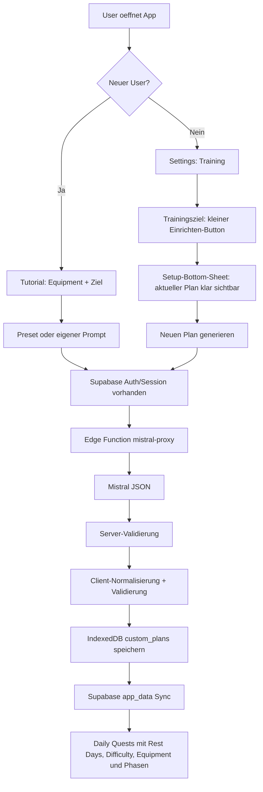
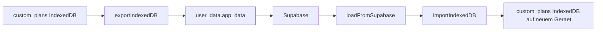

# KI-Trainingsplan Quality Pass

> Ziel: Das bestehende Mistral-/Supabase-Feature fuer KI-generierte Trainingsplaene vor echter User-Nutzung stabilisieren, UI/UX sauber machen und alle kritischen Flows fuer neue und bestehende User absichern.

---

## Ausgangslage

Die erste Version aus `plans/ai-training-plan.md` ist groesstenteils umgesetzt. Es gibt bereits:

| Bereich | Status | Gefundene Dateien |
|---|---|---|
| Mistral Client | vorhanden | `js/mistral-client.js` |
| Custom Plan System | vorhanden | `js/custom-plan-system.js` |
| Supabase Edge Function | vorhanden | `supabase/functions/mistral-proxy/index.ts` |
| IndexedDB Store | vorhanden | `js/database.js`, `custom_plans` in DB v36 |
| Settings UI | vorhanden, aber unfertig | `index.html`, `main.js`, `css/components/popups.css` |
| Tutorial Integration | vorhanden, aber riskant | `tutorial/js/tutorial_onboarding.js`, `tutorial/js/tutorial_main.js`, `tutorial/js/tutorial_state.js` |
| Tests | vorhanden | `tests/11-custom-plan.test.js` |

Aktueller Teststand nach Analyse:

```bash
node tests/run.js
```

Ergebnis: `1885 passed, 0 failed`.

Das bedeutet: Die bestehende Test-Suite ist gruen, aber sie deckt die gemeldeten UI-Probleme, echte Supabase-Deployment-Fragen, Tutorial-Haenger und einige Edge-Cases noch nicht ausreichend ab.

---

## Hauptprobleme

| Prioritaet | Problem | Warum wichtig |
|---|---|---|
| Hoch | Settings-Button `Einrichten` wirkt zu breit/unsauber | Er ist der Einstieg ins Feature und aktuell visuell falsch gewichtet. |
| Hoch | Setup- und Generate-Popups wirken generisch und unruhig | User sollen sofort verstehen: aktueller Plan, regenerieren, Schnellwahl, eigener Prompt. |
| Hoch | Custom Prompt Input steckt in einer extra `setting-item` Box | Das erzeugt die unerwuenschte Box um die Eingabebox. |
| Hoch | Material Icon im `Neuen Plan generieren` Button ist nicht sauber zentriert | Kleine UI-Fehler lassen das Feature unfertig wirken. |
| Hoch | Tutorial kann bei KI/Auth/Supabase-Problemen haengen oder verwirrend weiterlaufen | Neue User duerfen beim ersten App-Start nicht blockiert werden. |
| Hoch | Supabase-Sync ist indirekt ueber `app_data`, nicht als eigene Plan-Tabelle | Muss bewusst getestet und dokumentiert werden, sonst entsteht falsche Erwartung. |
| Hoch | Equipment-Auswahl wird bei Custom Plan Auswahl nicht hart gefiltert | Aktuell wird `needsEquipment` nur als Hint verwendet; bei `hasEquipment=false` koennen Equipment-Uebungen weiterhin auftauchen. |
| Mittel | Rest-Day UI erlaubt nur 0-3, Custom-System kann 0-7 | Inkonsistenz zwischen `custom-plan-system.js` und Settings-UI/`loadSettings()`. |
| Mittel | Server- und Client-Validierung sind aehnlich, aber nicht identisch | Risiko fuer Grenzfaelle, bei denen Server akzeptiert und Client spaeter anders baut. |
| Mittel | Mistral gibt zwar JSON per `response_format`, aber kein Retry/Repair bei validierungsnahem Output | Bei realen Antworten sollte es einen robusten zweiten Versuch oder klaren Fallback geben. |

---

## Soll-Zustand



---

## Design-Richtung

DailyQuest ist eine mobile-first RPG-/Training-PWA. Das Feature soll nicht wie ein technischer API-Dialog wirken, sondern wie eine ruhige Trainingskonfiguration im Stil der App.

### Leitlinien

| UI-Bereich | Ziel |
|---|---|
| Settings Row | Label links, kompakter Button rechts, kein Full-Width-Button. |
| Setup Popup | Bottom Sheet mit klarer Hierarchie: Status, Plan-Karte, Aktionen. |
| Generate Popup | Schnellwahl als drei klare Auswahl-Karten, Custom-Eingabe direkt darunter ohne Aussenbox. |
| Tutorial | Gleiche visuelle Sprache wie Popup, aber noch reduzierter und sicher gegen Haenger. |
| Buttons | Icons und Text sauber horizontal zentriert, mindestens 44px Touch-Ziel. |
| Input | Gross genug, fokussierbar, ohne zweite Box drumherum, mit kurzer Hilfszeile. |
| Loading | Kein endloser Zustand ohne Fallback; klare Meldung und Timeout. |

### Kein Design

- Keine Gradients.
- Keine Emojis im UI.
- Keine generischen AI-Karten.
- Keine inline Styles fuer neue UI-Strukturen.
- Keine zu kleinen Touch-Ziele.

---

## UI-Plan: Settings

### Ist

```html
<button type="button" id="goal-setup-button" class="settings-action-btn" style="flex:0 0 auto;padding:8px 16px;">
  Einrichten
</button>
```

Der Button sitzt zwar in einer Settings-Row, nutzt aber generische Klassen und Inline-Styles. Je nach `.settings-action-btn` Styling kann er zu breit oder optisch uneinheitlich wirken.

### Soll

```html
<div class="settings-subpage-item training-goal-row">
  <label data-lang-key="training_goal">Trainingsziel</label>
  <button type="button" id="goal-setup-button" class="training-goal-setup-button" data-lang-key="goal_setup_btn">
    Einrichten
  </button>
</div>
```

### CSS-Ziel

```css
.training-goal-row {
    align-items: center;
}

.training-goal-setup-button {
    flex: 0 0 auto;
    min-height: 44px;
    padding: 0 14px;
    border-radius: 999px;
    display: inline-flex;
    align-items: center;
    justify-content: center;
    white-space: nowrap;
}
```

### Akzeptanzkriterien

- Button ist nur so breit wie sein Inhalt plus Padding.
- Button bleibt rechts in der Settings-Zeile.
- Tap-Ziel ist mindestens 44px hoch.
- Keine Inline-Styles mehr fuer diesen Button.
- `current-plan-info` bleibt darunter als eigene Info-Zeile.

---

## UI-Plan: Popup 1 `Trainingsziel einrichten`

### Ist

Aktuell besteht das Popup aus Warnbox, `setting-item` Plananzeige und einer vertikalen Buttonliste. Das wirkt technisch und nicht wie ein bewusstes Setup-Sheet.

### Soll-Struktur

```html
<div id="goal-setup-popup" class="popup popup-large training-plan-popup">
  <div class="popup-drag-handle"></div>
  <div class="popup-content training-plan-sheet">
    <header class="training-plan-sheet-header">
      <span class="training-plan-kicker">Training</span>
      <h3>Trainingsziel einrichten</h3>
      <p>Pruefe deinen aktiven Plan oder erstelle einen neuen.</p>
    </header>

    <section class="active-plan-card">
      <span class="active-plan-label">Aktueller Plan</span>
      <strong id="current-plan-title">Muskelaufbau Standard</strong>
      <p id="current-plan-desc"></p>
      <p id="current-plan-stats"></p>
    </section>

    <div class="training-plan-actions">
      <button id="goal-regenerate-button" class="training-primary-action">
        <span class="material-symbols-rounded" aria-hidden="true">refresh</span>
        <span>Neuen Plan generieren</span>
      </button>
      <span id="regeneration-counter"></span>
      <button id="goal-setup-cancel" class="training-secondary-action">Abbrechen</button>
    </div>
  </div>
</div>
```

### Akzeptanzkriterien

- Der aktuelle Plan ist als klare Karte sichtbar.
- `refresh` Icon ist vertikal und horizontal im Button zentriert.
- Counter ist unter dem Primary Button lesbar, aber nicht dominant.
- Wenn Limit erreicht ist, ist der Button sichtbar disabled und der Counter erklaert warum.
- Das Popup funktioniert auf kleinen Screens ohne abgeschnittene Buttons.

---

## UI-Plan: Popup 2 `Neuen Trainingsplan`

### Ist

Preset-Buttons nutzen `settings-action-btn`; die eigene Beschreibung steckt in einer `.setting-item` Box mit Inline-Input. Dadurch entsteht die unerwuenschte Box um die Eingabebox.

### Soll-Struktur

```html
<div id="goal-generate-popup" class="popup popup-large training-plan-popup">
  <div class="popup-drag-handle"></div>
  <div class="popup-content training-plan-sheet">
    <header class="training-plan-sheet-header">
      <span class="training-plan-kicker">Plan Generator</span>
      <h3>Neuen Trainingsplan</h3>
      <p>Waehle eine Richtung oder beschreibe dein Ziel selbst.</p>
    </header>

    <section class="training-preset-grid" aria-label="Schnellwahl">
      <button class="training-preset-card" data-preset="kraft">...</button>
      <button class="training-preset-card" data-preset="ausdauer">...</button>
      <button class="training-preset-card" data-preset="abnehmen">...</button>
    </section>

    <section class="custom-plan-field">
      <label for="custom-plan-prompt">Eigene Beschreibung</label>
      <input type="text" id="custom-plan-prompt" maxlength="200">
      <small>Beispiel: Fokus auf Beine, kein Equipment, gelenkschonend.</small>
    </section>

    <div class="training-plan-actions">...</div>
  </div>
</div>
```

### Akzeptanzkriterien

- Keine `.setting-item` Box um den Custom Prompt.
- Custom Input wirkt wie ein echtes Textfeld, nicht wie eine Settings-Zeile.
- Presets sind kompakt, aber deutlich tappbar.
- Generate Button ist nur aktiv ab sinnvoller Eingabe bei Custom.
- Preset-Klick startet Generierung direkt oder zeigt eindeutig Loading.
- Loading ersetzt nicht dauerhaft den ganzen Inhalt ohne Exit-Moeglichkeit.

---

## UI-Plan: Tutorial

### Aktuelle Risiken

| Risiko | Datei | Warum kritisch |
|---|---|---|
| Bei Custom-Auswahl gibt es keinen sichtbaren aktiven Zustand | `tutorial/js/tutorial_onboarding.js` | User erkennt nicht klar, was ausgewaehlt wurde. |
| Generate Button erscheint nur bei Custom, aber Validierung ist minimal | `tutorial/js/tutorial_onboarding.js` | Leere oder zu kurze Eingaben koennen sich kaputt anfuehlen. |
| Bei Supabase/Mistral Fehler wird Fallback genutzt, aber der Flow kann sich wie ein Fehler anfuehlen | `tutorial/js/tutorial_onboarding.js` | Neuer User soll nicht denken, die App sei kaputt. |
| Auth kann nach Planerstellung kommen | `showAuthDuringTutorial()` | Redirect/Session muss Custom Plan sicher wiederherstellen. |
| `tutorial_main.js` laedt `trainingPlanType/customPlanId` aus `dq_intro_state` aktuell nicht sichtbar im Start-Abschnitt | `tutorial/js/tutorial_main.js` | Restore nach E-Mail-Redirect kann unvollstaendig sein. |

### Soll

- Presets und Custom haben dieselbe visuelle Sprache wie das Generate-Popup.
- Custom Input ist direkt sichtbar nach Auswahl, ohne Layoutsprung der alles verschiebt.
- Es gibt einen Timeout/Fallback fuer Planerstellung, damit der erste App-Start nie haengt.
- Bei Fallback wird ruhig kommuniziert: Standardplan wird genutzt, kann spaeter in Einstellungen angepasst werden.
- Nach Auth-Redirect muessen `trainingPlanType` und `customPlanId` wieder in Runtime-State und Settings landen.

### Akzeptanzkriterien

- Neuer User mit Supabase online: Preset generiert Custom Plan, Tutorial geht weiter, Quests erscheinen.
- Neuer User mit Supabase offline/API Fehler: Standardplan wird gesetzt, Tutorial geht weiter, kein Haenger.
- Neuer User mit Custom Prompt: Prompt ab 3 Zeichen generiert, sonst Button disabled.
- User ohne Equipment bekommt keine Equipment-Pflichtquests als Tagesquests.
- E-Mail-Redirect waehrend Tutorial verliert den erstellten Plan nicht.

---

## Technischer Plan: Mistral JSON Robustheit

### Aktuell gut

- Edge Function nutzt `response_format: { type: "json_object" }`.
- Edge Function validiert serverseitig mit `validatePlanShape()`.
- Client validiert mit `DQ_MISTRAL.validatePlan()`.
- Client baut unvollstaendige Responses ueber `buildFullPlan()` teilweise zu 30 Uebungen aus.

### Zu verbessern

| Thema | Plan |
|---|---|
| Server-Validation | `stages.length` auf genau 4 setzen, passend zum System-Prompt. |
| Client-Validation | Gleiches Schema wie Server dokumentieren und Abweichungen minimieren. |
| Equipment | Wenn `userContext.hasEquipment=false`, entweder Mistral-Prompt erzwingt `needsEquipment:false` oder Client filtert/ersetzt Equipment-Uebungen. |
| Retry | Bei 422/invalid JSON einmal mit strengerem Repair-Prompt erneut versuchen. |
| Fehlertext | User bekommt klare Meldung, technische Details nur in Console. |
| Token-Limit | `max_tokens: 4000` real mit 30 Uebungen pruefen; falls Responses abgeschnitten werden, auf kompaktes Schema oder hoeheres Limit wechseln. |

### Akzeptanzkriterien

- Mistral-Antwort ohne valides JSON wird nie gespeichert.
- Plan mit 29/31 Uebungen wird nicht gespeichert.
- Plan mit zu wenigen Rest-Uebungen wird nicht gespeichert oder vor Speicherung repariert.
- Plan ohne `custom_` Prefix bei unbekannten Keys wird abgelehnt.
- Letzte Phase hat immer `weeks: 9999`.
- Vier Phasen sind Standard und werden getestet.

---

## Technischer Plan: Equipment

### Ist

`buildCustomQuest()` setzt:

```javascript
equipmentHint: !!template.needsEquipment && hasEquipment
```

Das zeigt nur einen Hinweis, verhindert aber nicht sicher, dass bei `hasEquipment=false` Equipment-Uebungen ausgewaehlt werden.

### Soll

In `pickBalancedQuests()` oder vor dem Aufruf in `getTodayQuestSet()` muss der Pool bei `hasEquipment=false` gefiltert werden:

```javascript
let available = settings.hasEquipment === false
  ? customPlan.exercises.filter(ex => ex.needsEquipment !== true)
  : customPlan.exercises;
```

Wenn danach zu wenig Uebungen vorhanden sind:

- Nicht-Equipment Fallback-Uebungen ergaenzen.
- Oder bei der Plan-Generierung erzwingen, dass mindestens 20 Nicht-Equipment-Uebungen vorhanden sind, sobald `hasEquipment=false`.

### Akzeptanzkriterien

- `hasEquipment=false` erzeugt keine Tagesquest mit `needsEquipment=true`.
- Preset `kraft` ohne Equipment faellt sinnvoll auf Bodyweight/Calisthenics zurueck.
- Bestehende Custom-Plans werden bei Equipment-Off nicht kaputt, sondern gefiltert oder ersetzt.

---

## Technischer Plan: Rest Days

### Ist

- `custom-plan-system.js` kann 0-7 Rest Days verarbeiten.
- Settings UI bietet nur 0-3 Optionen.
- `main.js loadSettings()` normalisiert auf `[0, 1, 2, 3]`, sonst zurueck auf 2.

### Entscheidung noetig

| Option | Empfehlung | Beschreibung |
|---|---|---|
| 0-3 beibehalten | Ja, wenn App bewusst simpel bleiben soll | Dann `custom-plan-system.js` Tests fuer 4-7 nur als technische Robustheit behalten. |
| 0-7 erlauben | Nur wenn User wirklich jeden Umfang einstellen sollen | Dann UI, `loadSettings()`, Tests und Text anpassen. |

### Plan

Kurzfristig 0-3 beibehalten, aber dokumentieren und Tests auf realen UI-Bereich ausrichten. Wenn 4-7 gewuenscht ist, als separates Mini-Feature planen.

### Akzeptanzkriterien

- UI und Settings-Normalisierung sind konsistent.
- Rest-Day-Picker erzeugt niemals Werte, die `loadSettings()` sofort wieder verwirft.
- Custom-Plans respektieren Rest Days korrekt: Rest Day nutzt `isRest:true`, Training Day nutzt `isRest!==true`.

---

## Technischer Plan: Phasen und Difficulty

### Aktuell

- Custom Phasen kommen aus `plan.stages`.
- `getStageForState()` berechnet Phase ueber Wochen seit Start plus manuelle Shifts.
- Difficulty 1-5 wird in `buildCustomQuest()` ueber `DQ_TRAINING_SYSTEM.getDifficultyMultiplier()` genutzt.
- Rewards skalieren zusaetzlich ueber `loadFactor` und Difficulty.

### Zu pruefen

| Check | Erwartung |
|---|---|
| Difficulty 1 | Deutlich leichter, aber nicht unter sinnvolle Mindestwerte. |
| Difficulty 5 | Fordernd, aber keine absurden Werte. |
| Phase Repeat | Custom Plan wiederholt aktuelle Phase und reskaliert offene Quests. |
| Phase Skip | Custom Plan springt weiter und reskaliert offene Quests. |
| Phase Extend | Aktuelle Phase verlaengert sich ohne Datenverlust. |
| Existing User | Alte predefined Phasen funktionieren weiter. |

### Akzeptanzkriterien

- Tests decken Difficulty 1-5 fuer Custom-Quests ab.
- Tests decken Phase repeat/skip/extend fuer Custom-Plans ab.
- UI-Banner zeigt Custom-Phase korrekt an.
- Aenderungen an Difficulty/Equipment veraendern nur offene, nicht erledigte Quests.

---

## Supabase-Plan

### Ist

Custom-Plans werden lokal in IndexedDB gespeichert und ueber `DQ_SUPABASE.exportIndexedDB()` als Teil von `app_data` in Supabase synchronisiert. Es gibt keine eigene `custom_plans` Tabelle in Supabase.

Das ist grundsaetzlich okay, wenn bewusst so gewollt:



### Zu pruefen

| Thema | Plan |
|---|---|
| RLS | `user_data` und `dq_ai_generations` muessen RLS aktiv haben. |
| Policies | User darf nur eigene `user_data` und eigene Rate-Limit-Zeilen lesen/schreiben. |
| Edge Function Auth | `supabase.auth.getUser(token)` ist vorhanden, Deployment muss Env-Werte haben. |
| Rate Limit Tabelle | `dq_ai_generations` muss in Supabase existieren, sonst wird nur geloggt und nicht serverseitig limitiert. |
| Sync | Nach `generateAndSavePlan()` muss Supabase-Sync verlaesslich getriggert werden. |
| Import | Auf anderem Geraet muss `custom_plans` vor Import existieren, DB v36 erledigt das. |

### Akzeptanzkriterien

- Neuer Plan erscheint nach Sync auf anderem Geraet/Reload wieder als aktiver Plan.
- `customPlanId` in Settings zeigt auf einen existierenden Eintrag in `custom_plans`.
- Wenn `customPlanId` fehlt, faellt App sauber auf predefined zurueck.
- `dq_ai_generations` begrenzt serverseitig auf 3/Tag/User.
- Kein `service_role` Key im Client.
- Anon Key im Client bleibt nur Publishable/Anon-Kontext.

---

## Edge Function Deployment Check

Vor Release muss nicht nur Code, sondern Supabase Deployment geprueft werden.

```bash
supabase functions deploy mistral-proxy
supabase secrets set MISTRAL_API_KEY=...
```

Zusaetzlich pruefen:

| Check | Erwartung |
|---|---|
| `SUPABASE_URL` | In Edge Function Umgebung vorhanden. |
| `SUPABASE_ANON_KEY` | In Edge Function Umgebung vorhanden. |
| `MISTRAL_API_KEY` | Nur serverseitig als Secret, nie im Repo. |
| CORS | App kann Function aus Browser aufrufen. |
| Auth | Ohne Bearer Token kommt 401. |
| Valid Request | Mit Session kommt 200 oder valider 422/502 Fehler. |

---

## Testing-Plan

### Bestehende Tests erweitern

| Datei | Neue Checks |
|---|---|
| `tests/11-custom-plan.test.js` | Equipment-Off filtert Equipment-Uebungen; Difficulty 1-5; genau 4 Stages; Phase Actions dynamisch. |
| `tests/05-settings.test.js` | `planType/customPlanId` Defaults, Rest-Day Werte konsistent mit UI. |
| `tests/06-html-ids.test.js` | Neue Klassen/IDs fuer Popup-UI, keine entfernten IDs. |
| `tests/07-css-themes.test.js` | Neue CSS-Klassen nutzen Theme-Variablen fuer dark/light/OLED. |
| `tests/03-translations.test.js` | Neue Hilfstexte fuer Popup/Tutorial in DE/EN. |

### Manuelle Release-Tests

| Flow | Schritte | Erwartung |
|---|---|---|
| Existing User | App mit alter DB starten | Kein Tutorial-Zwang, predefined Plan bleibt nutzbar. |
| Settings Preset | Einstellungen -> Training -> Einrichten -> Neuer Plan -> Kraft | Plan wird erstellt, gespeichert, aktiviert, Popup Erfolg. |
| Settings Custom | Eigene Beschreibung eingeben | Button aktiv ab 3 Zeichen, Plan wird passend erstellt. |
| Tutorial Preset | Reset Tutorial -> Equipment -> Kraft | Tutorial laeuft durch, Custom Plan aktiv. |
| Tutorial Custom | Custom Ziel schreiben | Kein Haenger, Plan aktiv oder sauberer Fallback. |
| Offline/API Fehler | Function blockieren oder falsches Secret | Kein Haenger, Fallback und verstaendliche Meldung. |
| Equipment Off | Kein Equipment auswaehlen | Tagesquests enthalten keine Equipment-Pflicht. |
| Rest Day | Rest Days setzen, Datum/Logik pruefen | Rest-Day-Quests kommen aus `isRest:true`. |
| Sync | Plan generieren, Sync ausloesen, Reload/anderes Geraet | Aktiver Plan bleibt erhalten. |
| Rate Limit | 4 Generierungen am selben Tag | 4. Versuch blockiert client- und serverseitig. |

---

## Umsetzung in Phasen

### Phase 1: UI Cleanup Settings und Popups

| Aufgabe | Datei | Prioritaet |
|---|---|---|
| Inline-Styles vom `goal-setup-button` entfernen | `index.html` | Hoch |
| Eigene Button-Klasse fuer Trainingsziel einrichten | `css/components/popups.css` oder Settings-CSS | Hoch |
| Setup-Popup semantisch strukturieren | `index.html` | Hoch |
| Generate-Popup semantisch strukturieren | `index.html` | Hoch |
| Custom Prompt ohne `.setting-item` Box umsetzen | `index.html`, CSS | Hoch |
| Icon-Alignment fuer Action Buttons fixen | CSS | Hoch |

### Phase 2: Tutorial UX und Haenger-Schutz

| Aufgabe | Datei | Prioritaet |
|---|---|---|
| Tutorial-Auswahl visuell an Popup angleichen | `tutorial/js/tutorial_onboarding.js`, Tutorial CSS | Hoch |
| Custom Prompt Button-Status und Hilfstext verbessern | `tutorial/js/tutorial_onboarding.js` | Hoch |
| Timeout/Fallback fuer Plan-Generierung einbauen | `tutorial/js/tutorial_onboarding.js`, `js/mistral-client.js` | Hoch |
| `trainingPlanType/customPlanId` beim Intro-Restore sauber laden | `tutorial/js/tutorial_main.js` | Hoch |
| Fallback-Meldung ruhiger und nicht wie fataler Fehler formulieren | Translations | Mittel |

### Phase 3: Equipment, Rest Days, Difficulty, Phasen

| Aufgabe | Datei | Prioritaet |
|---|---|---|
| Custom Plan Pool bei `hasEquipment=false` filtern | `js/custom-plan-system.js` | Hoch |
| Nicht-Equipment Fallback bei zu kleinem Pool | `js/custom-plan-system.js` oder `js/mistral-client.js` | Hoch |
| Rest-Day UI und Normalisierung konsistent halten | `index.html`, `main.js`, Tests | Mittel |
| Difficulty 1-5 Runtime-Tests fuer Custom Quests | `tests/11-custom-plan.test.js` | Hoch |
| Phase repeat/skip/extend Runtime-Tests | `tests/11-custom-plan.test.js` | Mittel |

### Phase 4: Mistral und Supabase Hardening

| Aufgabe | Datei/System | Prioritaet |
|---|---|---|
| Server-Validation auf genau 4 Stages bringen | `supabase/functions/mistral-proxy/index.ts` | Mittel |
| Optionaler Retry/Repair bei invalid Plan | Edge Function oder `js/mistral-client.js` | Mittel |
| `dq_ai_generations` Migration/RLS pruefen | Supabase DB | Hoch |
| `user_data.app_data` Sync mit Custom Plan praktisch testen | Supabase/Auth | Hoch |
| Deployment-Check dokumentieren | Plan/README oder Release-Checklist | Mittel |

### Phase 5: Release-Verifikation

| Aufgabe | Erwartung |
|---|---|
| `node tests/run.js` | 0 failed |
| Browser-Test Mobile | Settings Button und Popups sauber auf kleinem Screen |
| Browser-Test Desktop | Keine Layout-Brueche |
| Supabase Live-Test | Function, Auth, Rate Limit, Sync funktionieren |
| Tutorial-Neustart | Neuer User kommt immer in die App |

---

## Betroffene Dateien

```text
index.html
  - Settings Training Row
  - goal-setup-popup
  - goal-generate-popup

css/components/popups.css
  - training-plan-popup
  - active-plan-card
  - training-preset-card
  - custom-plan-field
  - action button alignment

main.js
  - goal setup/generate listeners
  - handlePlanGeneration
  - loadSettings Rest-Day Normalisierung
  - updateCurrentPlanInfo

js/mistral-client.js
  - generatePlan timeout/retry
  - buildFullPlan/validatePlan Konsistenz
  - Regeneration Fehlerverhalten

js/custom-plan-system.js
  - Equipment-Filter
  - Rest-Day Auswahl
  - Difficulty/Phase Runtime-Verhalten

supabase/functions/mistral-proxy/index.ts
  - Schema-Validation
  - Rate-Limit-Verhalten
  - Deployment/Secrets

tutorial/js/tutorial_onboarding.js
  - Plan-Auswahl UI
  - Custom Prompt UX
  - Loading/Fallback

tutorial/js/tutorial_main.js
  - Restore trainingPlanType/customPlanId

tutorial/js/tutorial_state.js
  - Redirect-Recovery pruefen

data/translations.js
  - Neue Texte fuer Popup, Tutorial, Fehler, Loading

tests/11-custom-plan.test.js
  - Runtime-Tests fuer Equipment, Difficulty, Phasen, Schema
```

---

## Definition of Done

- Settings-Button `Einrichten` ist kompakt, sauber ausgerichtet und ohne Inline-Style.
- Beide Trainingsplan-Popups sind mobile-first, ruhig und klar strukturiert.
- Custom Prompt hat keine extra Aussenbox und ist angenehm zu bedienen.
- Material Icons in Buttons sind sauber zentriert.
- Presets und eigene Beschreibungen funktionieren in Settings und Tutorial.
- KI-Antworten werden niemals ungeprueft gespeichert.
- Ungueltige Mistral-Antworten fuehren zu Retry oder sauberem Fallback.
- Custom-Plans werden lokal gespeichert, aktiviert und ueber Supabase `app_data` synchronisiert.
- Supabase RLS/Policies und `dq_ai_generations` Rate-Limit sind live geprueft.
- Kein Equipment bedeutet keine Equipment-Pflichtquests.
- Rest Days nutzen wirklich Rest-Uebungen.
- Difficulty 1-5 beeinflusst Custom-Quests korrekt.
- Phasen funktionieren fuer Custom-Plans inklusive repeat/skip/extend.
- Neue User kommen auch bei KI/Supabase-Fehlern sicher durch das Tutorial.
- Bestehende User behalten ihre Daten und koennen das Feature optional nutzen.
- `node tests/run.js` bleibt gruen.

---

## Offene Entscheidungen

| Frage | Empfehlung |
|---|---|
| Sollen Rest Days weiter 0-3 bleiben oder auf 0-7 erweitert werden? | Kurzfristig 0-3 beibehalten, da UI aktuell so gebaut ist. |
| Soll Supabase eigene `custom_plans` Tabellen bekommen? | Erstmal nein; `app_data` Sync reicht, wenn sauber getestet. |
| Soll bei invalid Mistral JSON ein zweiter API-Versuch erfolgen? | Ja, einmaliger Retry mit strengerem Repair-Prompt. |
| Soll Preset-Klick sofort generieren oder erst Auswahl markieren und Confirm nutzen? | Settings: sofort generieren; Tutorial: sofort fuer Presets, Confirm fuer Custom. |
| Soll Equipment-Off schon im Prompt oder erst beim Quest-Picking greifen? | Beides: Prompt erzwingt es, Client filtert als Safety-Net. |

---

## Naechster Umsetzungsprompt

```text
Setze den Plan aus plans/ai-training-plan-quality-pass.md um.
Arbeite in dieser Reihenfolge:
1. UI Cleanup fuer Settings-Button und beide Trainingsplan-Popups.
2. Tutorial Plan-Auswahl und Loading/Fallback stabilisieren.
3. Equipment-Off fuer Custom-Plans technisch erzwingen.
4. Tests fuer Equipment, Difficulty 1-5, Phasen und UI-Struktur erweitern.
5. Supabase/Edge-Function Checkliste pruefen und dokumentieren.
Keine Gradients, keine Emojis im UI, mobile-first, bestehende DailyQuest-Designsprache beibehalten.
Am Ende node tests/run.js ausfuehren.
```

---

*Plan erstellt am 20.06.2026 fuer DailyQuest KI-Trainingsplan Quality Pass.*
