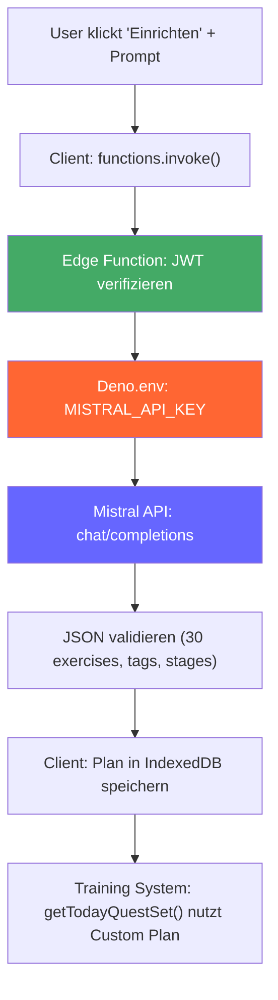
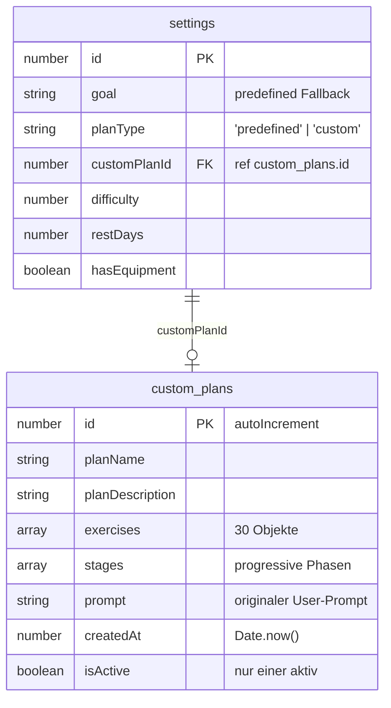
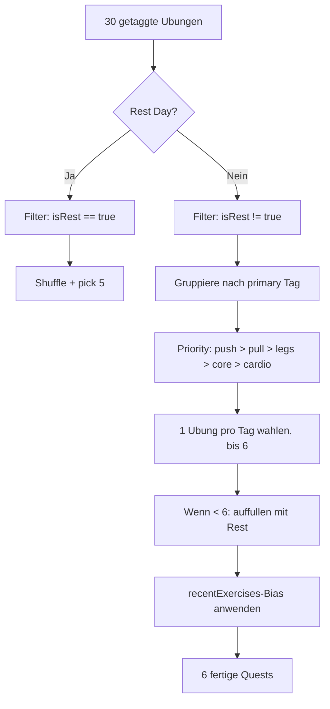
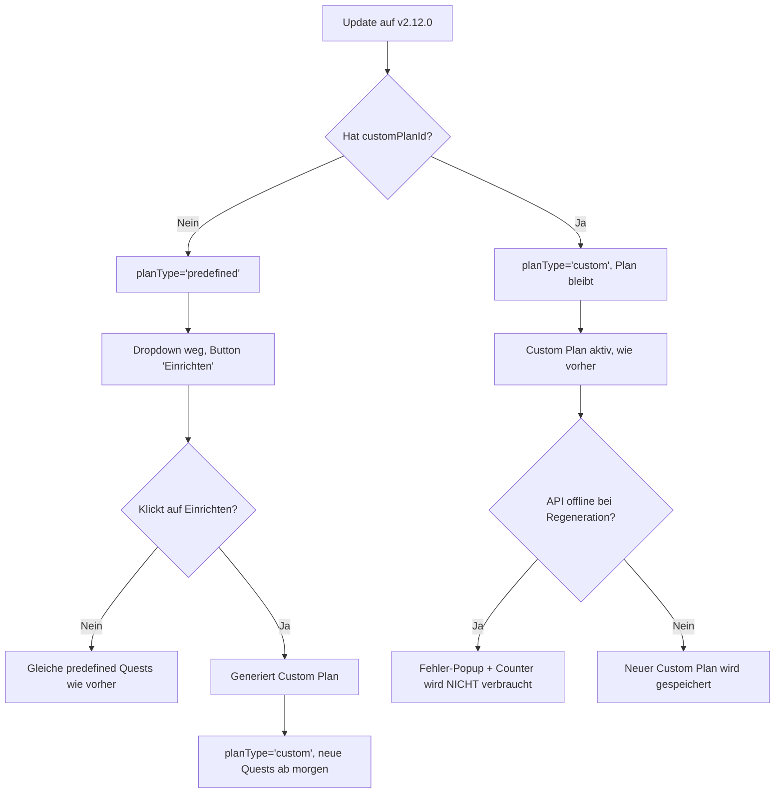

# KI-Trainingsplan mit Mistral API

> Feature: Statisches Trainingsziel-Dropdown durch KI-gestutzte, naturlichsprachliche Trainingsplan-Erstellung ersetzen.

---

## Konkreter Ablauf

```
Neuer User -> App -> Tutorial -> "Kraft & Muskelaufbau" (Preset)
                                              |
                                     Mistral generiert 30 Ubungen
                                     (getaggt: push/pull/legs/core/cardio/rest)
                                     + 4 progressive Phasen
                                              |
                                     Jeden Tag: 6 balancierte Quests
                                     (eine pro Haupt-Tag)
                                              |
                                     Nach 2 Wochen: auto-Progression
                                     zur nachsten Phase
```

In den Settings kann der User jederzeit "Einrichten" klicken, seinen aktuellen Plan sehen, und mit eigenem Prompt regenerieren ("Ich will mehr Fokus auf Beine").

---

## Entscheidungen

| # | Entscheidung | Wert |
|---|-------------|------|
| 1 | **API-Key** | Supabase Edge Function (`mistral-proxy`) halt Key server-side |
| 2 | **Ubungs-Pool** | Hybrid: bestehende `nameKeys` + neue mit `custom_` Prefix |
| 3 | **Struktur** | 30 flache Ubungen mit Tags, Balancing-Algorithmus |
| 4 | **Rest Days** | Wochentag-Logik bleibt; KI taggt Ubungen mit `isRest: true` |
| 5 | **Phasen** | KI generiert progressive Phasen (weeks/sets/reps) |
| 6 | **Migration** | Dropdown verschwindet; bestehende `goal`-Werte bleiben als Fallback |
| 7 | **Tutorial** | 3 Presets (Kraft/Ausdauer/Abnehmen) + Custom-Textbox |
| 8 | **Fallback** | Bei API-Fehler -> predefined Plan + Info-Popup |
| 9 | **Regeneration** | Max 3x pro Tag, Counter in localStorage |

---

## UI Wireframes

### Settings: Training-Sektion (Before / After)

```
BEFORE                              AFTER
┌────────────────────┐              ┌────────────────────┐
│ Training           │              │ Training           │
├────────────────────┤              ├────────────────────┤
│ Schwierigkeit   [3]│              │ Schwierigkeit   [3]│
│ Trainingsziel     │              │ Trainingsziel      │
│ [Muskelaufbau  ▾] │              │ [Einrichten]       │
│                    │              │                    │
│ Rest Days      [2]│              │ Aktuell: KI-Plan   │
│ Equipment    [AN] │              │ 'Kraft & Muskel-   │
│                    │              │ aufbau'            │
│ Phase              │              │ Rest Days      [2]│
│ [Wdh][Uberspr]    │              │ Equipment    [AN] │
│ [Verlaeng]        │              │                    │
└────────────────────┘              │ Phase              │
                                    │ [Wdh][Uberspr]    │
                                    │ [Verlaeng]        │
                                    └────────────────────┘
```

### Popup: "Trainingsziel einrichten"

```
┌────────────────────────────────┐
│ ═══════════════════════════════ │  <- drag handle
│                                │
│     Trainingsziel einrichten   │
│                                │
│  ┌──────────────────────────┐  │
│  │ Dein aktueller Plan:     │  │
│  │                          │  │
│  │ KI-Plan: Kraft &         │  │
│  │ Muskelaufbau             │  │
│  │ 30 Ubungen, 4 Phasen     │  │
│  │ Erstellt: 19.06.2026     │  │
│  └──────────────────────────┘  │
│                                │
│  [ Neuen Plan generieren  ]   │
│    3/3 Regenerierungen heute   │
│                                │
│  [ Abbrechen ]                 │
└────────────────────────────────┘
```

### Popup: "Neuen Trainingsplan"

```
┌────────────────────────────────┐
│ ═══════════════════════════════ │
│     Neuen Trainingsplan         │
│                                │
│ SCHNELLWAHL                    │
│                                │
│ [🏋 Kraft & Muskelaufbau   ]  │
│ [🏃 Ausdauer & Cardio      ]  │
│ [🔥 Gewicht verlieren      ]  │
│                                │
│ ODER EIGENE BESCHREIBUNG       │
│                                │
│ ┌────────────────────────────┐ │
│ │ Ich will starkere Beine    │ │
│ │ und mehr Flexibilitat...   │ │
│ └────────────────────────────┘ │
│                                │
│ [✨ Plan generieren        ]  │
│                                │
│ [ Abbrechen ]                  │
└────────────────────────────────┘
```

### Tutorial: Plan-Auswahl

```
┌────────────────────────────────┐
│                                │
│     Was ist dein               │
│     Trainingsziel?             │
│                                │
│  [🏋 Kraft & Muskelaufbau   ]  │
│   Starke, Masse, Hanteln       │
│                                │
│  [🏃 Ausdauer & Cardio      ]  │
│   Kondition, Laufen, HIIT      │
│                                │
│  [🔥 Gewicht verlieren      ]  │
│   Fatburn, Diet, Cardio        │
│                                │
│  [✏ Custom: Eigener Plan   ]  │
│   Beschreibe dein Ziel         │
│                                │
│  [________________________]   │  <- erscheint bei Custom
│                                │
│  [ Plan generieren ]           │
└────────────────────────────────┘
```

---

## Architektur

### Datenfluss: KI-Plan Generierung



### Komponenten

| Komponente | Status | Beschreibung |
|------------|--------|-------------|
| `supabase/functions/mistral-proxy/index.ts` | **NEU** | Deno Edge Function. Halt MISTRAL_API_KEY als Secret. |
| `js/mistral-client.js` | **NEU** | `DQ_MISTRAL` Modul. API-Aufruf, Fallback, Validierung, Rate-Limit. |
| `js/custom-plan-system.js` | **NEU** | `DQ_CUSTOM_PLAN` Modul. Balancing, Quest-Building, Stage-Progression. |
| `js/training_system.js` | MODIFIED | `getPlan()` / `getTodayQuestSet()`: custom Plan Branch. |
| `index.html` | MODIFIED | Dropdown -> Button, 2 neue Popups, Script-Tags. |
| `tutorial/js/tutorial_onboarding.js` | MODIFIED | `showTrainingPlanSelection()` ersetzt `showGoalSelection()`. |
| `data/translations.js` | MODIFIED | Neue DE/EN Keys fur alle UI-Strings. |

---

## Datenmodell

### Mistral API JSON Response

```json
{
  "planName": "Kraft & Muskellaufbau",
  "planDescription": "Fokus auf Muskelaufbau mit Hanteln",
  "exercises": [
    {
      "nameKey": "bicep_curls",
      "displayName": "Kurzhantel-Curls",
      "description": "Kontrollierte Curls fur Bizeps",
      "type": "reps",
      "baseValue": 10,
      "tags": ["pull", "arms"],
      "isRest": false,
      "needsEquipment": true,
      "muscles": ["biceps"],
      "statPoints": { "kraft": 1 },
      "mana": 20,
      "gold": 6
    },
    {
      "nameKey": "custom_push_variant_1",
      "displayName": "Explosive Liegestutze",
      "description": "Liegestutze mit explosiver Aufwartsbewegung",
      "type": "reps",
      "baseValue": 8,
      "tags": ["push", "chest"],
      "isRest": false,
      "needsEquipment": false,
      "muscles": ["chest", "triceps"],
      "statPoints": { "kraft": 1, "beweglichkeit": 0.5 },
      "mana": 25,
      "gold": 8
    },
    {
      "nameKey": "custom_rest_walk",
      "displayName": "Entspannter Spaziergang",
      "description": "30 Min leichter Spaziergang zur Erholung",
      "type": "check",
      "baseValue": 1,
      "tags": ["rest", "recovery"],
      "isRest": true,
      "needsEquipment": false,
      "muscles": ["legs"],
      "statPoints": { "durchhaltevermoegen": 0.5 },
      "mana": 15,
      "gold": 5
    }
  ],
  "stages": [
    { "labelKey": "custom_phase_1", "label": "Fundament", "weeks": 2, "sets": 2, "reps": 8 },
    { "labelKey": "custom_phase_2", "label": "Aufbau", "weeks": 2, "sets": 3, "reps": 10 },
    { "labelKey": "custom_phase_3", "label": "Peak", "weeks": 2, "sets": 3, "reps": 12 },
    { "labelKey": "custom_phase_4", "label": "Endgame", "weeks": 9999, "sets": 4, "reps": 12 }
  ]
}
```

**Feld-Bedeutungen:**

| Feld | Beschreibung |
|------|-------------|
| `nameKey` | Bestehend (z.B. `bicep_curls`) oder `custom_`-Prefix + unique ID |
| `tags` | 1-3 Tags: `push`, `pull`, `legs`, `core`, `cardio`, `rest`, `mobility`, `full_body` |
| `isRest` | `true` = wird nur an Rest Days gewahlt |
| `type` | `reps`, `time`, `check`, `focus` |
| `stages[]` | Progressive Phasen mit `weeks`, `sets`, `reps`. Letzte: `weeks: 9999` |

### IndexedDB: Neuer Store `custom_plans`



**Anerungen an `database.js`:**
- `dbVersion` von 35 auf 36 erhohen
- Neuer Object Store `custom_plans` (`keyPath: 'id', autoIncrement: true`)
- Store zur Reset-Liste in `supabase-client.js:501-506` hinzufugen
- Sync erfolgt automatisch (exportIndexedDB iteriert alle Stores)

---

## Edge Function: mistral-proxy

### API Spezifikation

```
POST /mistral-proxy
Authorization: Bearer <supabase-jwt>  (auto-attached by client)
Content-Type: application/json

{
  "prompt": "kraft" | "ausdauer" | "abnehmen" | "<freier Text>",
  "userContext": {
    "age": 34,
    "hasEquipment": true,
    "difficulty": 3,
    "restDays": 2
  }
}

Response 200:
{
  "planName": "...",
  "exercises": [...],
  "stages": [...]
}

Response 400: Invalid prompt or JSON validation
Response 500: Mistral API error or internal error
Response 429: Rate limited
```

### Edge Function Code

```typescript
// supabase/functions/mistral-proxy/index.ts
import { createClient } from "https://esm.sh/@supabase/supabase-js@2";

const MISTRAL_API_KEY = Deno.env.get("MISTRAL_API_KEY")!;
const MISTRAL_URL = "https://api.mistral.ai/v1/chat/completions";

const PRESET_PROMPTS: Record<string, string> = {
  kraft: "Erstelle einen Trainingsplan fur Kraft und Muskelaufbau mit Hanteln.",
  ausdauer: "Erstelle einen Trainingsplan fur Ausdauer und Cardio-Training.",
  abnehmen: "Erstelle einen Trainingsplan fur Gewichtsverlust und Fatburn."
};

const SYSTEM_PROMPT = `Du bist ein Fitness-Experte. Erstelle einen Trainingsplan als JSON.
Erforderliche Felder:
- planName (string)
- planDescription (string)
- exercises (array von genau 30 Objekten)
- stages (array von 4 Phasen)

Jede Exercise braucht: nameKey, displayName, description, type (reps/time/check),
baseValue, tags (array), isRest (boolean), needsEquipment, muscles, statPoints, mana, gold.

Verwende diese bestehenden nameKeys wenn passend: [LISTE aus exercises.js]
Oder erfinde neue mit "custom_" Prefix.

Mindestens 4 exercises mussen isRest:true haben (fur Rest Days).
Tags aus: push, pull, legs, core, cardio, rest, mobility, full_body.

response_format: json_object`;

export default async (req: Request) => {
  // 1. JWT verifizieren
  const auth = req.headers.get("Authorization");
  if (!auth) return new Response("Unauthorized", { status: 401 });

  // 2. Prompt auslesen (Preset oder Custom)
  const { prompt, userContext } = await req.json();
  const userPrompt = PRESET_PROMPTS[prompt] || prompt;

  // 3. Mistral API aufrufen
  const response = await fetch(MISTRAL_URL, {
    method: "POST",
    headers: {
      "Authorization": `Bearer ${MISTRAL_API_KEY}`,
      "Content-Type": "application/json"
    },
    body: JSON.stringify({
      model: "mistral-small-latest",
      messages: [
        { role: "system", content: SYSTEM_PROMPT },
        { role: "user", content: userPrompt + JSON.stringify(userContext) }
      ],
      response_format: { type: "json_object" },
      temperature: 0.7
    })
  });

  const data = await response.json();
  const planJson = JSON.parse(data.choices[0].message.content);

  // 4. Minimal-Validierung
  if (!planJson.exercises || planJson.exercises.length !== 30) {
    return new Response("Invalid plan: need 30 exercises", { status: 500 });
  }

  return new Response(JSON.stringify(planJson), {
    headers: { "Content-Type": "application/json" }
  });
};
```

### Deployment

```bash
supabase functions deploy mistral-proxy
supabase secrets set MISTRAL_API_KEY=sk-...
```

> **Security**: Key bleibt server-side im Deno.env. Client sieht nur Responses. Keine Anderung an `schema.sql` notig (Custom Plans werden in IndexedDB gespeichert und via `app_data` synced).

---

## Balancing-Algorithmus

### 6-Quest-Auswahl aus 30 getaggten Ubungen



```javascript
// js/custom-plan-system.js (Auszug)
const DQ_CUSTOM_PLAN = {
  pickBalancedQuests(exercises, count = 6, isRestDay = false) {
    // 1. Filter: Rest Day -> nur isRest:true, sonst nur isRest:false
    let pool = isRestDay
      ? exercises.filter(ex => ex.isRest === true)
      : exercises.filter(ex => ex.isRest !== true);

    if (isRestDay) {
      return this.shuffle(pool).slice(0, 5);
    }

    // 2. Gruppiere nach primarem Tag (erster Tag im tags-Array)
    const byTag = {};
    pool.forEach(ex => {
      const tag = ex.tags[0] || 'full_body';
      if (!byTag[tag]) byTag[tag] = [];
      byTag[tag].push(ex);
    });

    // 3. Priority: push/pull/legs/core/cardio -> eine pro Tag
    const priorityTags = ['push', 'pull', 'legs', 'core', 'cardio', 'full_body'];
    const selected = [];
    const usedKeys = new Set();

    for (const tag of priorityTags) {
      if (selected.length >= count) break;
      const candidates = (byTag[tag] || []).filter(ex => !usedKeys.has(ex.nameKey));
      if (candidates.length > 0) {
        const pick = candidates[Math.floor(Math.random() * candidates.length)];
        selected.push(pick);
        usedKeys.add(pick.nameKey);
      }
    }

    // 4. Auffullen falls < 6
    while (selected.length < count && selected.length < pool.length) {
      const remaining = pool.filter(ex => !usedKeys.has(ex.nameKey));
      if (remaining.length === 0) break;
      const pick = remaining[Math.floor(Math.random() * remaining.length)];
      selected.push(pick);
      usedKeys.add(pick.nameKey);
    }

    return selected;
  },

  shuffle(arr) {
    const a = [...arr];
    for (let i = a.length - 1; i > 0; i--) {
      const j = Math.floor(Math.random() * (i + 1));
      [a[i], a[j]] = [a[j], a[i]];
    }
    return a;
  }
};
```

---

## Implementierung

### Betroffene Dateien

```
supabase/
  functions/
    mistral-proxy/
      index.ts                        + NEU    Edge Function fur Mistral API
  config.toml                         + NEU    Supabase project config

js/
  mistral-client.js                   + NEU    DQ_MISTRAL Modul (API, Fallback, Validierung)
  custom-plan-system.js               + NEU    DQ_CUSTOM_PLAN Modul (Balancing, Quests)
  training_system.js                  MOD      getPlan/getTodayQuestSet: custom Branch
  database.js                         MOD      dbVersion 35->36, custom_plans Store

index.html                            MOD      Dropdown -> Button, 2 Popups, Scripts
main.js                               MOD      Settings-Listener, saveSetting, generateDailyQuests

tutorial/
  js/
    tutorial_onboarding.js            MOD      showTrainingPlanSelection()
    tutorial_main.js                  MOD      Neue state fields

data/translations.js                  MOD      Neue Keys fur UI-Strings

css/components/popups.css             MOD      Styling neue Popups

tests/
  02-data-structure.test.js           MOD      Custom Plan Struktur
  06-html-ids.test.js                 MOD      Neue IDs registrieren
  11-custom-plan.test.js              + NEU    Balancing, Validierung, Migration
```

### Phasen

| Phase | Was | Abhangigkeit |
|-------|-----|-------------|
| 1 | **Edge Function** erstellen + deployen + Secret setzen | - |
| 2 | **`js/mistral-client.js`**: API-Aufruf, Fallback, Validierung | Phase 1 |
| 3 | **`js/custom-plan-system.js`**: Balancing, Quest-Building | - |
| 4 | **IndexedDB**: `custom_plans` Store, `planType`/`customPlanId` in Settings | - |
| 5 | **Training System**: custom Branch in `getTodayQuestSet` | Phase 3+4 |
| 6 | **Settings UI**: Button + Popups in `index.html` + CSS | Phase 4 |
| 7 | **Tutorial**: `showTrainingPlanSelection()` ersetzen | Phase 2+3 |
| 8 | **Migration**: Bestandsuser behalten predefined, Fallback-Logik | Phase 5 |
| 9 | **Tests + Lint**: Alle neuen Tests schreiben | Alle |

---

## Quest-Generation Integration

### training_system.js: Custom Plan Branch

```javascript
// MODIFIZIERT: getTodayQuestSet mit custom Plan Branch
async getTodayQuestSet(forceRegenerate = false) {
    const settings = DQ_CONFIG.userSettings || {};
    const goal = this.normalizeGoal(settings.goal || 'muscle');

    // NEU: Custom Plan Branch
    if (settings.planType === 'custom' && settings.customPlanId) {
        const customPlan = await DQ_CUSTOM_PLAN.getActivePlan(settings.customPlanId);
        if (customPlan) {
            return await DQ_CUSTOM_PLAN.getTodayQuestSet(customPlan, settings);
        }
        // Fallback: custom plan nicht gefunden -> predefined
        console.warn('Custom Plan nicht gefunden, nutze predefined');
    }

    // BESTEHEND: predefined Plan Pfad (unverandert)
    if (goal === 'sick' || goal === 'restday') {
        return { goal, quests: [], state: null, plan: null };
    }
    // ... bestehende Logik ...
}
```

### custom-plan-system.js: getTodayQuestSet

```javascript
// DQ_CUSTOM_PLAN.getTodayQuestSet
async getTodayQuestSet(customPlan, settings) {
    const todayStr = DQ_CONFIG.getTodayString();
    const isRestDay = this.checkRestDay(settings.restDays);
    const difficulty = settings.difficulty || 3;
    const hasEquipment = settings.hasEquipment !== false;

    // 1. Stage berechnen (wie bestehendes getStageForState)
    const state = await this.getState(customPlan.id);
    const stageContext = this.getStageForState(customPlan.stages, state);

    // 2. 6 balancierte Ubungen wahlen
    const exercises = isRestDay
        ? DQ_CUSTOM_PLAN.pickBalancedQuests(customPlan.exercises, 5, true)
        : DQ_CUSTOM_PLAN.pickBalancedQuests(customPlan.exercises, 6, false);

    // 3. Quests bauen
    const quests = exercises.map((template, index) => {
        return this.buildCustomQuest(
            customPlan, template, stageContext,
            todayStr, index, difficulty, hasEquipment
        );
    });

    // 4. State updaten
    state.lastGeneratedDate = todayStr;
    state.lastStageIndex = stageContext.stageIndex;
    await this.saveState(state);

    return { goal: 'custom', quests, state, plan: customPlan, stageContext };
}
```

---

## Tutorial Integration

```javascript
// tutorial/js/tutorial_onboarding.js - ERSETZT showGoalSelection()
async showTrainingPlanSelection() {
    const textContainer = document.getElementById('tutorial-text-container');
    if (!textContainer) return;

    this.showText('Was ist dein Trainingsziel?');
    await this.delay(600);

    textContainer.insertAdjacentHTML('beforeend', `
        <div id="tutorial-plan-selection" class="tutorial-selection-container">
            <button class="tutorial-choice-btn" data-preset="kraft">
                <span class="material-symbols-rounded">fitness_center</span>
                <span>Kraft & Muskelaufbau</span>
                <span class="choice-description">Starke, Masse, Hanteln</span>
            </button>
            <button class="tutorial-choice-btn" data-preset="ausdauer">
                <span class="material-symbols-rounded">directions_run</span>
                <span>Ausdauer & Cardio</span>
                <span class="choice-description">Kondition, Laufen, HIIT</span>
            </button>
            <button class="tutorial-choice-btn" data-preset="abnehmen">
                <span class="material-symbols-rounded">local_fire_department</span>
                <span>Gewicht verlieren</span>
                <span class="choice-description">Fatburn, Diet, Cardio</span>
            </button>
            <button class="tutorial-choice-btn" data-preset="custom">
                <span class="material-symbols-rounded">edit</span>
                <span>Custom: Eigener Plan</span>
                <span class="choice-description">Beschreibe dein Ziel</span>
            </button>
            <div id="tutorial-custom-input" style="display:none;">
                <input type="text" id="tutorial-plan-prompt"
                    placeholder="z.B. starke Beine und mehr Flexibilitat"
                    maxlength="200">
            </div>
            <button id="tutorial-plan-generate" class="card-button hidden">
                Plan generieren
            </button>
        </div>
        <div id="tutorial-plan-loading" class="hidden">
            <p>Plan wird generiert...</p>
        </div>
    `);

    // Custom-Button toggelt Textbox
    document.querySelector('[data-preset="custom"]').addEventListener('click', () => {
        document.getElementById('tutorial-custom-input').style.display = 'block';
        document.getElementById('tutorial-plan-generate').classList.remove('hidden');
    });

    // Preset-Buttons -> sofort generieren
    document.querySelectorAll('[data-preset]').forEach(btn => {
        if (btn.dataset.preset === 'custom') return;
        btn.addEventListener('click', async () => {
            await this.handlePlanSelection(btn.dataset.preset, null);
        });
    });

    // Custom-Generate
    document.getElementById('tutorial-plan-generate').addEventListener('click', async () => {
        const prompt = document.getElementById('tutorial-plan-prompt').value.trim();
        if (!prompt) return;
        await this.handlePlanSelection('custom', prompt);
    });
}

async handlePlanSelection(preset, customPrompt) {
    document.getElementById('tutorial-plan-selection').classList.add('fade-out');
    document.getElementById('tutorial-plan-loading').classList.remove('hidden');

    try {
        const plan = await DQ_MISTRAL.generatePlan(
            customPrompt || preset,
            { age: this.age, hasEquipment: this.hasEquipment }
        );
        const planId = await DQ_CUSTOM_PLAN.savePlan(plan);
        this.trainingPlanType = 'custom';
        this.customPlanId = planId;
    } catch (e) {
        DQ_UI.showCustomPopup('Fehler bei Generierung. Fallback-Plan wird genutzt.', 'penalty');
        this.trainingPlanType = 'predefined';
        this.trainingGoal = preset === 'kraft' ? 'muscle'
            : preset === 'ausdauer' ? 'endurance' : 'fatloss';
    }

    document.getElementById('tutorial-plan-loading').classList.add('hidden');
    await this.hideText();
    await this.delay(250);
    await this.showAuthDuringTutorial();
    await this.initializeCharacterWithName(this.playerName);
    await this.showWelcomeSequence();
}
```

### Tutorial-Constraints

- `initializeCharacterWithName` muss `planType` und `customPlanId` in settings schreiben
- `generateDailyQuestsIfNeeded(true)` muss den custom Branch nutzen
- Senior-Mode (age>=60) uberspringt `showTrainingPlanSelection` weiterhin
- Intro-State in localStorage muss `trainingPlanType` + `customPlanId` enthalten (redirect recovery)
- `DQ_TUTORIAL_STATE.resetTutorial()` muss custom-plans Store clearen

---

## Settings UI Integration

### HTML: Dropdown -> Button

```diff
-<div class="settings-subpage-item">
-    <label for="goal-select" data-lang-key="training_goal">Trainingsziel</label>
-    <select id="goal-select">
-        <option value="muscle" data-lang-key="goal_muscle">Muskelaufbau</option>
-        <option value="endurance" data-lang-key="goal_endurance">Ausdauer</option>
-        <option value="fatloss" data-lang-key="goal_fatloss">Abnehmen</option>
-        <option value="kraft_abnehmen" data-lang-key="goal_kraft_abnehmen">Kraft + Abnehmen</option>
-        <option value="calisthenics" data-lang-key="goal_calisthenics">Calisthenics</option>
-        <option value="senior" data-lang-key="goal_senior">Senioren-Training</option>
-        <option value="sick" data-lang-key="goal_sick">Krank</option>
-    </select>
-</div>
+<div class="settings-subpage-item">
+    <label data-lang-key="training_goal">Trainingsziel</label>
+    <button type="button" id="goal-setup-button"
+        class="settings-action-btn" style="flex:0 0 auto;padding:8px 16px;">
+        Einrichten
+    </button>
+</div>
+<div class="settings-subpage-item" id="current-plan-info">
+    <label data-lang-key="current_plan">Aktuell:</label>
+    <span id="current-plan-name">Muskelaufbau (Standard)</span>
+</div>
```

### HTML: Neue Popups

> Popup 1: `#goal-setup-popup` - "Trainingsziel einrichten"
> Zeigt aktuellen Plan-Namen, Beschreibung, Stats, Regenerieren-Button + Counter + Abbrechen.

> Popup 2: `#goal-generate-popup` - "Neuen Trainingsplan"
> 3 Preset-Buttons (Kraft/Ausdauer/Abnehmen) + Custom-Textbox + Generieren-Button + Loading-State.

Beide Popups folgen der bestehenden `.popup`-Konvention: `.popup-drag-handle` + `.popup-content` mit `<h3>` + `.popup-actions` mit `.card-button`-Buttons.

---

## Validierung

### Client-seitige JSON-Validierung in `js/mistral-client.js`

```javascript
const DQ_MISTRAL = {
    validatePlan(plan) {
        const errors = [];

        // 1. Top-Level
        if (!plan.planName || typeof plan.planName !== 'string')
            errors.push('planName fehlt');
        if (!plan.exercises || !Array.isArray(plan.exercises))
            errors.push('exercises fehlt');
        if (!plan.stages || !Array.isArray(plan.stages))
            errors.push('stages fehlt');

        // 2. Genau 30 Ubungen
        if (plan.exercises && plan.exercises.length !== 30) {
            errors.push(`Brauche 30 exercises, got ${plan.exercises?.length}`);
        }

        // 3. Mindestens 4 isRest Ubungen
        if (plan.exercises) {
            const restCount = plan.exercises.filter(ex => ex.isRest === true).length;
            if (restCount < 4) errors.push('Mindestens 4 isRest Ubungen notig');
        }

        // 4. Jede Ubung validieren
        const validTypes = ['reps', 'time', 'check', 'focus'];
        const validTags = ['push', 'pull', 'legs', 'core', 'cardio',
                          'rest', 'mobility', 'full_body'];
        const existingKeys = new Set(
            Object.values(DQ_DATA.exercisePool).flat().map(ex => ex.nameKey)
        );

        if (plan.exercises) {
            plan.exercises.forEach((ex, i) => {
                if (!ex.nameKey) errors.push(`exercise[${i}].nameKey fehlt`);
                if (!validTypes.includes(ex.type))
                    errors.push(`exercise[${i}].type invalid: ${ex.type}`);
                if (!ex.tags || ex.tags.length === 0)
                    errors.push(`exercise[${i}].tags fehlt`);
                if (typeof ex.baseValue !== 'number' || ex.baseValue < 1)
                    errors.push(`exercise[${i}].baseValue invalid`);
                if (!ex.displayName) errors.push(`exercise[${i}].displayName fehlt`);

                // Hybrid-Regel: bestehende OK, neue mussen custom_ haben
                if (!existingKeys.has(ex.nameKey) && !ex.nameKey.startsWith('custom_')) {
                    errors.push(`exercise[${i}].nameKey muss custom_ Prefix haben`);
                }
            });
        }

        // 5. Stages validieren
        if (plan.stages) {
            if (plan.stages.length < 2) errors.push('Mindestens 2 Phasen notig');
            plan.stages.forEach((stage, i) => {
                if (typeof stage.weeks !== 'number') errors.push(`stage[${i}].weeks fehlt`);
                if (typeof stage.sets !== 'number') errors.push(`stage[${i}].sets fehlt`);
                if (typeof stage.reps !== 'number') errors.push(`stage[${i}].reps fehlt`);
            });
            const last = plan.stages[plan.stages.length - 1];
            if (last && last.weeks < 9999) errors.push('Letzte Phase muss weeks:9999 haben');
        }

        return { valid: errors.length === 0, errors };
    },

    async generatePlan(prompt, userContext) {
        try {
            const { data, error } = await DQ_SUPABASE.client.functions.invoke(
                'mistral-proxy', { body: { prompt, userContext } }
            );
            if (error) throw error;

            const validation = this.validatePlan(data);
            if (!validation.valid) {
                console.error('Plan validation failed:', validation.errors);
                throw new Error('Invalid plan: ' + validation.errors.join(', '));
            }
            return data;
        } catch (e) {
            console.error('Mistral API error:', e);
            DQ_UI.showCustomPopup(
                'Fehler bei Plan-Generierung. Ein Fallback-Plan wird genutzt.',
                'penalty'
            );
            throw e;
        }
    },

    getRegenerationCount() {
        const today = DQ_CONFIG.getTodayString();
        const data = localStorage.getItem('dq_mistral_regen');
        if (!data) return 0;
        try {
            const parsed = JSON.parse(data);
            return parsed.date === today ? parsed.count : 0;
        } catch { return 0; }
    },

    canRegenerate() { return this.getRegenerationCount() < 3; },

    incrementRegeneration() {
        const today = DQ_CONFIG.getTodayString();
        const count = this.getRegenerationCount();
        localStorage.setItem('dq_mistral_regen',
            JSON.stringify({ date: today, count: count + 1 }));
    }
};
```

**Validierungsregeln:**

| Check | Beschreibung |
|-------|-------------|
| Top-Level | `planName`, `exercises`, `stages` mussen existieren |
| Count | Genau 30 exercises |
| Rest | Mindestens 4 exercises mit `isRest: true` |
| Type | Nur `reps`, `time`, `check`, `focus` |
| Tags | Mindestens 1 Tag aus erlaubter Liste |
| baseValue | Nummer >= 1 |
| nameKey | Bestehend ODER `custom_`-Prefix |
| Stages | Mindestens 2, letzte mit `weeks: 9999` |

---

## Migration & Fallback

### Bestandsuser: Was passiert beim Update?



**Fallback-Logik:**
1. API-Call schlagt fehl -> Error-Popup: "Fehler bei Generierung. Fallback-Plan wird genutzt."
2. `planType='predefined'` mit altem `goal` als Fallback
3. Generierung-Counter wird bei Fehlern NICHT verbraucht
4. User kann "Erneut versuchen" klicken
5. Bisheriger Custom Plan bleibt in IndexedDB erhalten

---

## Tests

| Datei | Bereich | Was wird getestet |
|-------|---------|-------------------|
| `tests/11-custom-plan.test.js` (NEU) | Custom Plan | JSON-Validierung, Balancing (6 aus 30, Tag-Diversitat), Rest-Filter, Stage-Berechnung, Migration |
| `tests/02-data-structure.test.js` | Daten | Custom Plan Struktur in IndexedDB, `settings.planType` Feld |
| `tests/06-html-ids.test.js` | DOM | Neue IDs: `goal-setup-button`, `goal-setup-popup`, `goal-generate-popup`, `custom-plan-prompt` |
| `tests/08-training-plans.test.js` | Training | Custom Plan in `getTodayQuestSet`, Fallback auf predefined |
| `tests/01-syntax.test.js` | Syntax | Alle neuen `.js` Dateien syntaktisch korrekt |

---

## Open Questions

### 1. Welches Mistral-Modell?

| Modell | Kosten/Call | Qualitat |
|--------|------------|----------|
| **mistral-small-latest** (Empfohlen) | ~$0.002 | Gut fur strukturierte JSON-Generierung |
| mistral-large-latest | ~$0.02 | Hoher, aber 10x teurer |
| open-mistral-7b | Selbst gehostet | Fraglich fur komplexe JSON |

### 2. Wie detailliert sollen Preset-Prompts sein?

| Variante | Beschreibung |
|----------|-------------|
| **Generisch** (Empfohlen) | "Erstelle einen Kraft-Plan mit Fokus auf Muskelaufbau" -> KI hat Freiheit |
| Spezifisch | "Verwende push_ups, deadlifts, bicep_curls..." -> Konsistent, weniger Variabilitat |

### 3. Sollen Custom Plans uber Gerate synchronisiert werden?

| Variante | Beschreibung |
|----------|-------------|
| **Sync via app_data** (Empfohlen) | Plan auf allen Geraten. Keine zusatzlichen API-Calls beim Geratewechsel. |
| Nur lokal | Plan bleibt auf dem Gerat, wo er erstellt wurde. |

### 4. Phase-Buttons fur Custom Plans?

| Variante | Beschreibung |
|----------|-------------|
| **Ja, aktiv** (Empfohlen) | User kann Phasen manuell wiederholen/uberspringen/verlangern. Konsistente UX. |
| Nein, nur auto-Progression | Custom Plans laufen automatisch. Einfacher.

---

*Plan erstellt am 19.06.2026 fur DailyQuest v2.12.0*
